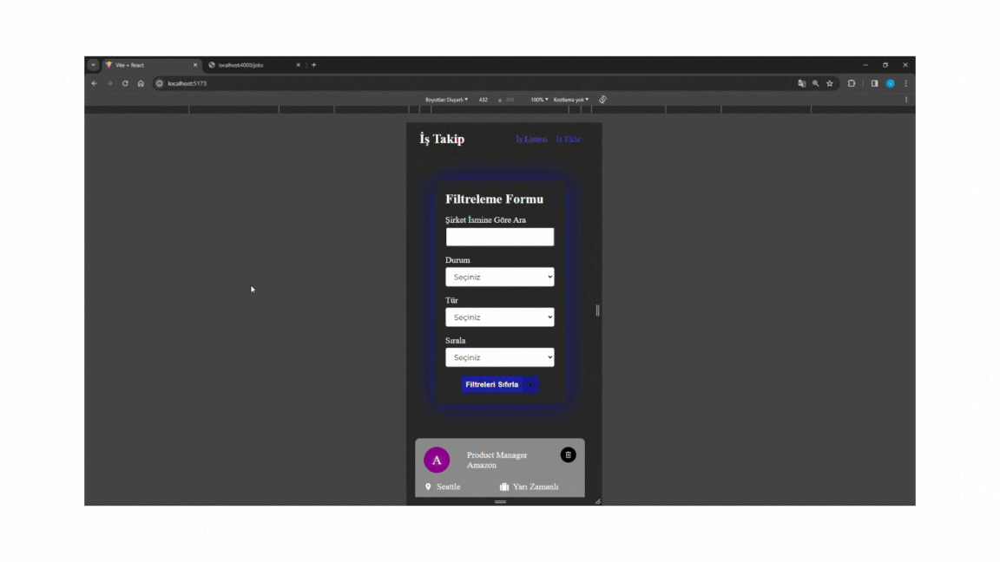

<h1>İş Takip Projesi</h1>
<h2>Konu : </h2>

Redux Toolkit Öğrenme 

<h2>Özellikleri: </h2>

Yeni bir iş eklenebiliyor 

Daha önceden kayıtlı olanları otomatik tanımlanabilir.

Filtreleme yapılabilir

<h2>Kullanılan Kütüphaneler:</h2>
-react-router-dom (Sayfalandırma)
-axios (Api'dan veri çekme işlemleri)
-json-server (Api'dan veri çekme işlemleri)
-sass (Stillendirme)
-react-toastify (Bilgi verme)
-react-redux (State Yönetimi)
-@reduxjs/toolkit (State Yönetimi)
-uuid (Verilerin id)
-react-icons (icon kütüphanesi)

